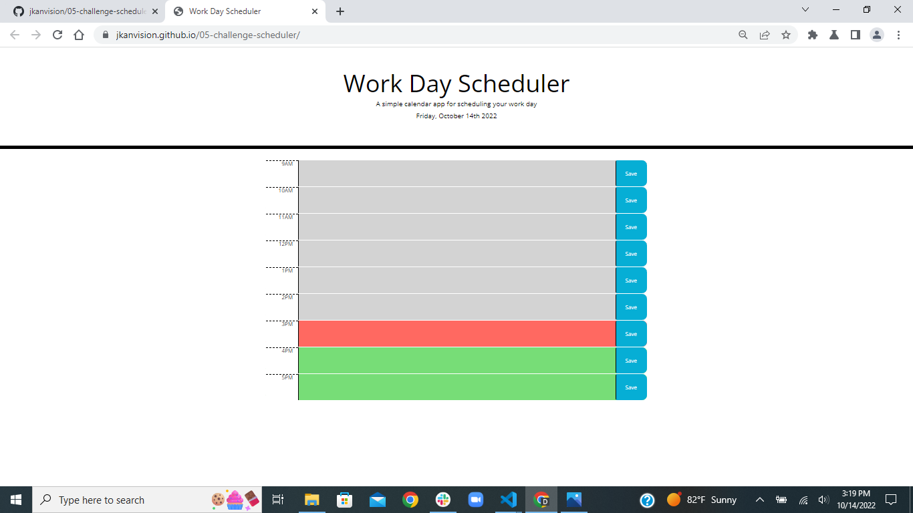

# 05-challenge-scheduler

## Description:
The "Work Day Scheduler" webpage provides users with a form to store and edit daily tasks during their day. This webpage features a simple design with timeblocks for each hour of the traditional work schedule, color-coded to correspond with past, present, and future hours. Users can enter and edit text for each time block, which is stored into local storage when the save button is clicked. The data saved by the user is re-displayed when the user returns to the site or refreshes their page. 

&nbsp;
&nbsp;

&nbsp;\
&nbsp;\
&nbsp;\
[Workday Scheduler Webpage](https://jkanvision.github.io/05-challenge-scheduler/)